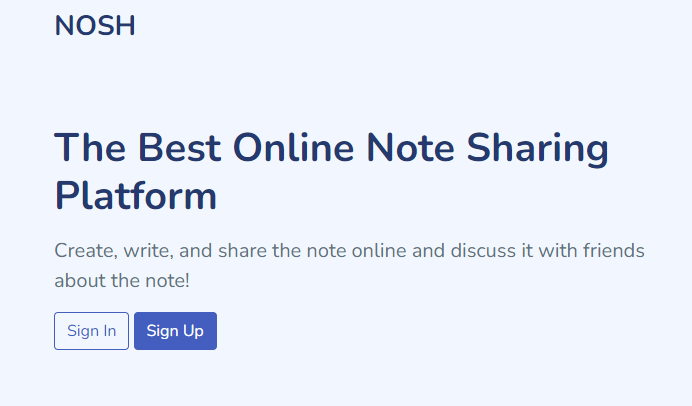

# NOSH

## User Manual
### About Nosh
NOSH is a website application that acts as a platform for sharing notes. Nosh provides the platform to create a note, sharing a note, and a forum-like environment which enables the users to have a discussion over the notes they have shared.
### Point of Contacts
Provide a list of points of organizational contact (POCs) that may be needed by the document user for informational and troubleshooting purposes. Include type of contact, contact name, and e-mail address. Points of contact may  include, but are not limited to, help desk POC, development/maintenance POC, and operations POC.
#### Information
* Ahmad Fatih
  * As Back End Programmer
* Mochamad Ferdy Fauzan 
  * As Front End Programmer
* Seno Aji Wicaksono
  * As Database Programmer
## Getting Started
### Homepage

- First of all, users should access our website application by going to our website. Accessing any of our website subpages for the first time will result in users redirected to the home page, in which there are two buttons, ‘sign in’ and ‘sign up’.

  - In order to use our website to create and edit notes, users should log in to their account by clicking the ‘sign in’ button. Log in could be done if the user already has registered an account.
  - Registering an account could be done by clicking the sign up button from the home page or login page. Users could register an account by inserting some information such as username, email, and password, which then the email and password will be used as a login credential.
### Dashboard Page

- After logging in, users will be redirected to the dashboard page. In this page, users will see notes titles that have been created. If the user has not created any notes before, there are no notes that will be displayed.
- Users could create new notes by hovering their pointer over the ‘Files’ tab then clicking ‘New Note’.  Users could also delete their own notes by clicking the ‘x’ button on the right side.
### Note Editor

- Users could view and edit their own notes by clicking at the notes titles, which then the user will be redirected to the note page. In this editor page, users could edit the title and its contents.
- There are a few things that could be adjusted in the text, such as text sizes, bold, italic, underline, strikethrough, and subscript and superscript. Users could also create a bulleted or numbered point text. Users also could insert images and create hyperlinks in the note contents. Users could share notes by sharing its link.C
### Comments

- Users could add comments to the notes by inserting text inside the textbox provided. Comments written will be shown in the bottom side of the page, along with the username of the user who made the comment.
